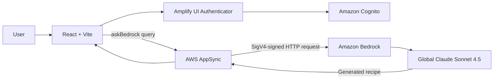

# AI Recipe Generator

An authenticated, serverless recipe generator built with React, AWS Amplify
Gen 2, AWS AppSync, Amazon Cognito, and Amazon Bedrock. A signed-in user enters
ingredients, and Global Claude Sonnet 4.5 creates a practical recipe with
quantities and numbered instructions.

## Features

- Email sign-up, verification, sign-in, and password recovery with Cognito
- Authenticated GraphQL recipe-generation query
- Global Claude Sonnet 4.5 inference through Amazon Bedrock
- Defensive handling of GraphQL and Bedrock error responses
- Per-developer Amplify cloud sandboxes
- Full-stack deployment from GitHub with Amplify Hosting

## Architecture



The backend does **not** use Lambda. The `askBedrock` AppSync query uses a
custom JavaScript resolver and a signed HTTP data source to invoke Bedrock
directly.

## Technology

| Layer | Technology |
| --- | --- |
| Frontend | React 19, Vite 8, Amplify UI |
| Authentication | Amazon Cognito |
| API | AWS AppSync GraphQL |
| Backend definition | AWS Amplify Gen 2 and AWS CDK |
| Generative AI | Global Claude Sonnet 4.5 on Amazon Bedrock |
| Hosting and CI/CD | AWS Amplify Hosting |

## Project structure

```text
.
|-- amplify/
|   |-- auth/resource.ts       # Cognito email authentication
|   |-- data/resource.ts       # GraphQL schema and authorization
|   |-- data/bedrock.js        # AppSync request/response resolver
|   `-- backend.ts             # Bedrock data source and IAM permissions
|-- src/
|   |-- App.jsx                # Authenticator, form, query, and result UI
|   `-- App.css
|-- amplify.yml                # Full-stack Amplify Hosting build
`-- package.json
```

## Prerequisites

- An AWS account with billing enabled
- Node.js 20 or newer
- npm 10 for reproducible installs in this repository
- Git
- AWS CLI v2
- An AWS profile configured with temporary credentials, preferably through
  IAM Identity Center
- Permission to deploy Amplify Gen 2 resources
- Access to Anthropic Claude models in Amazon Bedrock

Do not use root access keys. For local development, AWS recommends an IAM
Identity Center profile with the `AmplifyBackendDeployFullAccess` managed
policy.

## Install

Clone the repository and install from the committed lockfile:

```bash
git clone <your-repository-url>
cd ai-recipe-generator
npx --yes npm@10.9.2 ci
```

Use npm 10 when adding or updating dependencies:

```bash
npx --yes npm@10.9.2 install <package-name>
```

Using npm 11 to regenerate this project's lockfile can produce a dependency
tree that fails under Amplify's npm 10 clean-install environment.

## Configure AWS credentials

The recommended setup uses IAM Identity Center:

```bash
aws configure sso --profile amplify-dev
aws sso login --profile amplify-dev
aws sts get-caller-identity --profile amplify-dev
```

The final command should return the AWS account and role you intend to use.
An AWS Console username and password alone are not programmatic credentials.

See the
[Amplify local-development account setup](https://docs.amplify.aws/react/start/account-setup/)
for the complete IAM Identity Center workflow.

## Enable Global Claude Sonnet 4.5

This application uses the system-defined global inference profile:

```text
global.anthropic.claude-sonnet-4-5-20250929-v1:0
```

The request is signed and sent through the `us-east-1` Bedrock Runtime
endpoint. The backend grants `bedrock:InvokeModel` to:

1. The Global Claude Sonnet 4.5 inference profile
2. The source-Region foundation model
3. The global foundation-model resource used for cross-Region routing

Before testing:

1. Open Amazon Bedrock in `us-east-1`.
2. Select Global Claude Sonnet 4.5 in the model catalog or playground.
3. Complete Anthropic's first-time-use form if AWS requests it.
4. Confirm that a playground prompt returns a response.

Global inference can process prompts in supported commercial AWS Regions
worldwide. Review this behavior before using the app with data that has
residency or compliance requirements. See
[Global cross-Region inference](https://docs.aws.amazon.com/bedrock/latest/userguide/global-cross-region-inference.html).

## Run locally

Deploy a personal cloud sandbox:

```bash
npx ampx sandbox --profile amplify-dev
```

Keep that terminal running. The command deploys development resources, watches
the `amplify` directory, and generates the ignored `amplify_outputs.json` file
that contains the Cognito and AppSync configuration.

In a second terminal:

```bash
npm run dev
```

Open the URL printed by Vite, create an account, confirm the verification code
sent by email, sign in, and submit comma-separated ingredients.

To perform a single sandbox deployment without watch mode:

```bash
npx ampx sandbox --once --profile amplify-dev
```

To delete your personal sandbox resources:

```bash
npx ampx sandbox delete --profile amplify-dev
```

Sandbox and Bedrock usage can incur AWS charges.

## Backend behavior

The `askBedrock` query accepts an array of ingredient strings and is restricted
to authenticated Cognito users:

```ts
askBedrock: a
  .query()
  .arguments({ ingredients: a.string().array() })
  .returns(a.ref("BedrockResponse"))
  .authorization((allow) => [allow.authenticated()])
```

The resolver asks Claude to return:

- A recipe title
- Ingredient quantities
- Numbered preparation instructions

Successful Bedrock responses are returned to the browser as JSON. Non-2xx
responses are returned through the schema's `error` field so the frontend can
display the underlying Bedrock error instead of failing while reading a
missing response field.

## Deploy with Amplify Hosting

Connect the GitHub repository and `main` branch to Amplify Hosting. This
repository's `amplify.yml` performs:

1. A clean npm 10 dependency installation
2. `ampx pipeline-deploy` for the Gen 2 backend
3. Generation of `amplify_outputs.json`
4. The Vite production build
5. Deployment of the `dist` directory

### Amplify service role

The hosted build needs a dedicated backend deployment role:

1. In IAM, create or select a role whose use case is
   **Amplify - Backend Deployment**.
2. In Amplify, open **App settings > IAM roles**.
3. Assign the role under **Service role**.
4. Ensure it has the AWS-managed `AmplifyBackendDeployFullAccess` policy.
5. Keep `AdministratorAccess-Amplify` if Amplify attached it when creating the
   service role.

The build log should show Amplify assuming this role rather than an internal
`AemiliaControlPlaneLambda-CodeBuildRole`.

AWS documents the service-role setup in
[Adding a service role](https://docs.aws.amazon.com/amplify/latest/userguide/amplify-service-role.html).

### CDK bootstrap

Amplify Gen 2 uses AWS CDK. If the target account and Region do not contain a
version 6 or newer bootstrap stack, run the following from AWS CloudShell or
an authorized local profile:

```bash
aws sts get-caller-identity
npx --yes aws-cdk@latest bootstrap aws://<account-id>/<amplify-app-region>
```

Always verify the account ID and Region before bootstrapping.

### Deploy

```bash
git add .
git commit -m "update recipe generator"
git push origin main
```

Amplify will automatically deploy the backend and frontend.

## Validation

Run these checks before pushing:

```bash
npx tsc --noEmit -p amplify/tsconfig.json
npx eslint src amplify/data/bedrock.js
npm run build
```

`npm run build` requires a generated local `amplify_outputs.json`. Start or
deploy a sandbox first if the file is absent.

## Troubleshooting

### `npm ci` reports a missing `@opentelemetry/core@2.0.0`

Regenerate only the lockfile with npm 10, validate it, then commit it:

```bash
npx --yes npm@10.9.2 install --package-lock-only --ignore-scripts
npx --yes npm@10.9.2 ci --dry-run
git add package-lock.json
```

### `Could not resolve '../amplify_outputs.json'`

The outputs file is generated and intentionally excluded from Git. For local
development, deploy a sandbox. For Amplify Hosting, confirm that `amplify.yml`
contains the backend `pipeline-deploy` phase and that it completes before the
frontend build.

### `BootstrapDetectionError` or denied `ssm:GetParameter`

Confirm that Amplify is assuming the configured backend deployment service
role and that the role has `AmplifyBackendDeployFullAccess`. That policy grants
access to `/cdk-bootstrap/*` parameters and the CDK deployment roles.

### `The security token included in the request is invalid`

Refresh temporary credentials and specify the intended profile:

```bash
aws sso login --profile amplify-dev
aws sts get-caller-identity --profile amplify-dev
npx ampx sandbox --profile amplify-dev
```

### Bedrock returns an error

Test Global Claude Sonnet 4.5 in the `us-east-1` Bedrock playground. Check the
Anthropic first-time-use requirement, Bedrock quotas, IAM permissions, and any
AWS Organizations service-control policies that restrict global inference.

### npm prints React, XState, Zod, or audit warnings

These warnings do not by themselves fail the build. Use the process exit code
and the first `npm error`, Vite error, or Amplify error to identify the actual
failure. Do not run `npm audit fix --force` without reviewing its breaking
changes.

## Security and cost notes

- Recipe generation requires a signed-in Cognito user.
- Do not commit `amplify_outputs.json`, `.amplify`, credentials, access keys,
  or session tokens.
- Protect the root AWS account with MFA and do not create root access keys.
- Global inference can route data across commercial AWS Regions.
- Bedrock charges for model input and output tokens.
- Amplify sandboxes create real cloud resources; delete unused sandboxes.
- Use AWS Budgets and billing alerts while developing.

## Further reading

- [AWS Amplify Gen 2 documentation](https://docs.amplify.aws/react/)
- [Configure AWS for local development](https://docs.amplify.aws/react/start/account-setup/)
- [Amplify Hosting build specification](https://docs.aws.amazon.com/amplify/latest/userguide/yml-specification-syntax.html)
- [Global Claude Sonnet 4.5](https://docs.aws.amazon.com/bedrock/latest/userguide/model-card-anthropic-claude-sonnet-4-5.html)
- [Global cross-Region inference](https://docs.aws.amazon.com/bedrock/latest/userguide/global-cross-region-inference.html)
